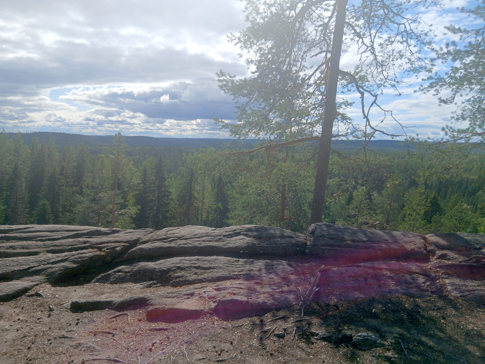

I completed my PhD thesis *Bayesian Ordinary Differential Equation and Gaussian Process Modeling of Biomedical Data* in the [Computational Systems Biology](https://research.cs.aalto.fi/csb/) group of Aalto University, Department
of Computer Science. I work with [Generable Inc.](https://www.generable.com/), employing
probabilistic models to support decision-making in drug development.

{width=100%}
