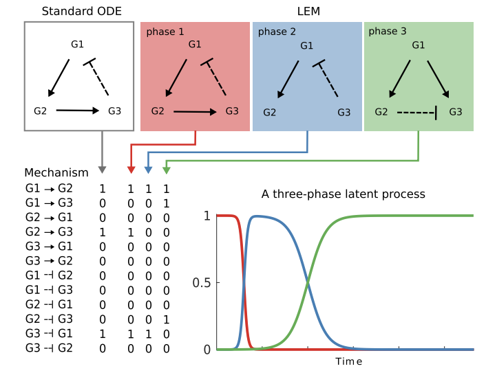
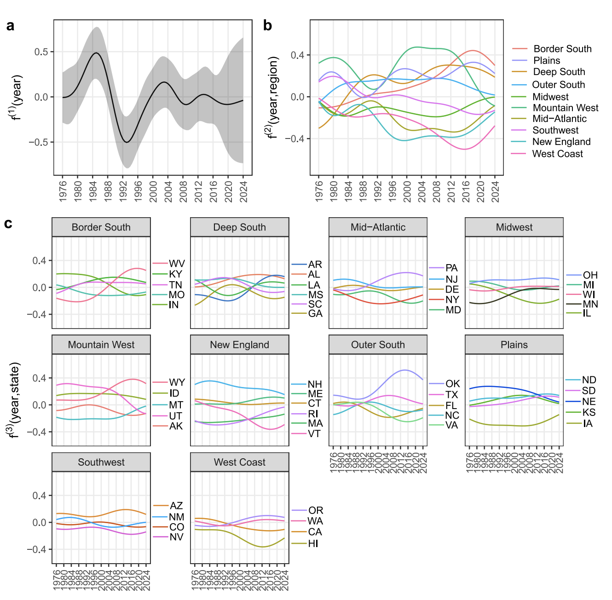

* *Bayesian machine learning model guiding iterative, personalized anticoagulant dosing decision-making: ENGAGE AF-TIMI 48 trial analysis* (2025). Gibson, C.M., Chen, C., Buros-Novik, J., Novik, E., **Timonen, J.**, Braunwald, E., Antman, E.M., Fronk, E., Clasen, M., Giugliano, R.P., Unverdorben, M., [JACC: Advances (to appear)](https://doi.org/10.1016/j.jacadv.2025.102504)

* *Scalable mixed-domain Gaussian process modeling and model reduction for longitudinal data* (2025). **Timonen, J**. & Lähdesmäki, H., [Bayesian Analysis (to appear)](https://projecteuclid.org/journals/bayesian-analysis/advance-publication/Scalable-Mixed-Domain-Gaussian-Process-Modeling-and-Model-Reduction-for/10.1214/25-BA1539.full)

* *An importance sampling approach for reliable and efficient inference in Bayesian ordinary differential equation models* (2023). **Timonen, J.**, Siccha, N., Bales, B., Lähdesmäki, H. & Vehtari, A.,  [Stat](https://onlinelibrary.wiley.com/doi/10.1002/sta4.614). 12, 1, e614.

* *lgpr: an interpretable non-parametric method for inferring covariate effects from longitudinal data* (2021). **Timonen, J.**, Mannerström, H., Vehtari, A. & Lähdesmäki, H., [Bioinformatics](https://academic.oup.com/bioinformatics/article/37/13/1860/6104850). 37, 13, p. 1860-1867.

* *A probabilistic framework for molecular network structure inference by means of mechanistic modeling* (2018). **Timonen, J.**, Mannerström, H., Lähdesmäki, H. & Intosalmi, J., [IEEE-ACM Transactions on Computational Biology and Bioinformatics](https://ieeexplore.ieee.org/document/8334413). 16, 6, p. 1843-1854

:::{.border}
 
:::

::: {layout-ncol=2}

:::

