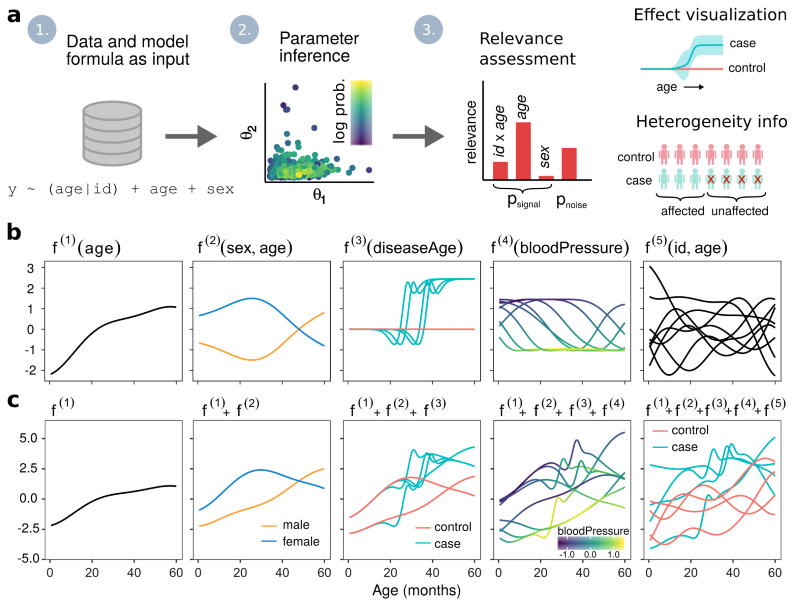

I have written several R packages for probabilistic modeling
that use [Stan](https://mc-stan.org/) under
the hood for fitting the models.

* [odemodeling](https://github.com/jtimonen/odemodeling): Building and fitting Bayesian ODE models 
* [lgpr](https://jtimonen.github.io/lgpr-usage/): Modeling longitudinal data using Gaussian processes
* [lgpr2](https://github.com/jtimonen/lgpr2): Scalable Gaussian process modeling of longitudinal data

:::{.border}
 
:::

{width=500}

